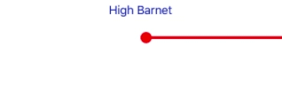
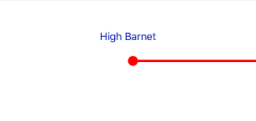
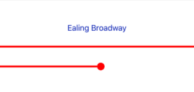
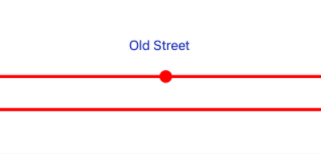
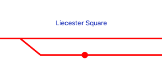
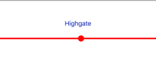
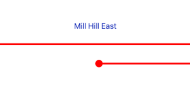
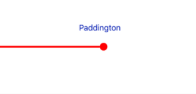
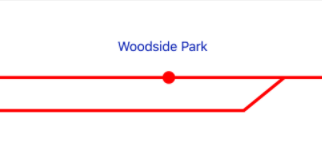

# TubeLineStops - Swift


[](https://github.com/pablogsIO/TubeLineStops)
[](https://github.com/pablogsIO/TubeLineStops)


<p align="center">

</p>

A simple UIView subclass that allows you to draw tube line stops.

This class draws parts of the line, these parts could be the beginning of the line, the end, forks, unions etc. You can see here different types:

<p align="center">

</p>
<p align="center">

</p>
<p align="center">

</p>
<p align="center">

</p>
<p align="center">

</p>
<p align="center">

</p>
<p align="center">

</p>
<p align="center">

</p>


## Demo

You have a fully functional demo in TubeLineStops folder.


## Example Usage

```swift

var stop: TubeLineStop()

stop.lineColor = UIColor.red
stop.stopType = .tailLeft

```

## License

TubeLineStops is available under the MIT license. See the LICENSE file for more info.

If you use it, i'll be happy to know about it.
